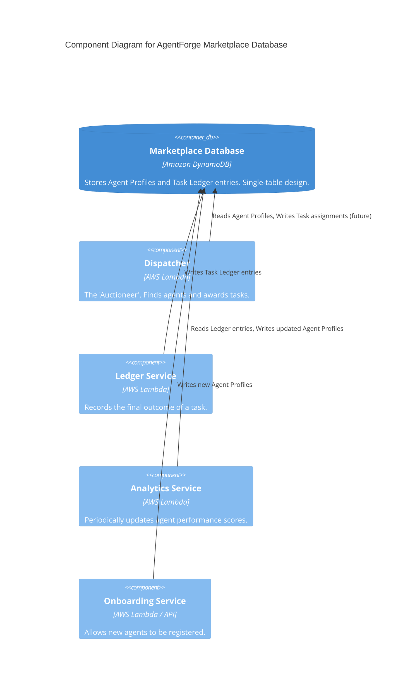

# AgentForge Database - C4 Component Diagram

This diagram illustrates the components within our system that interact with the central marketplace database.

## Description

This diagram shows the four primary services that will interact directly with the DynamoDB table:

1.  **Dispatcher:** This is the core of the auction system. It needs to read the `Agent Profiles` to find suitable agents for a task.
2.  **Ledger Service:** After a task is complete, this service is responsible for writing the final `Task Ledger Entry` into the database.
3.  **Analytics Service:** This is a background process that runs periodically (e.g., once an hour). It reads the recent `Task Ledger Entries` and updates the `performance_history` map within the `Agent Profiles`.
4.  **Onboarding Service:** A simple service, likely exposed via an API Gateway, that allows a new agent to be added to the system by creating a new `Agent Profile` item.
